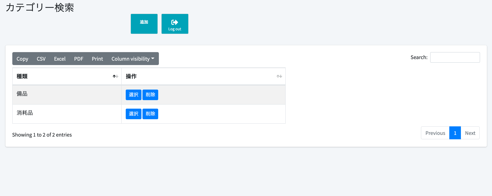
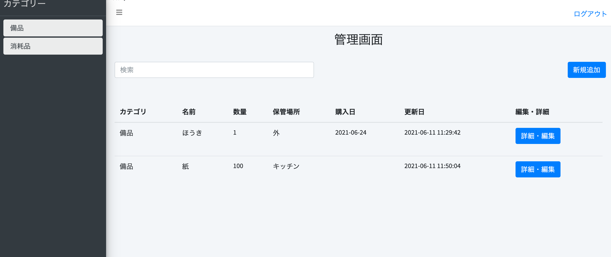
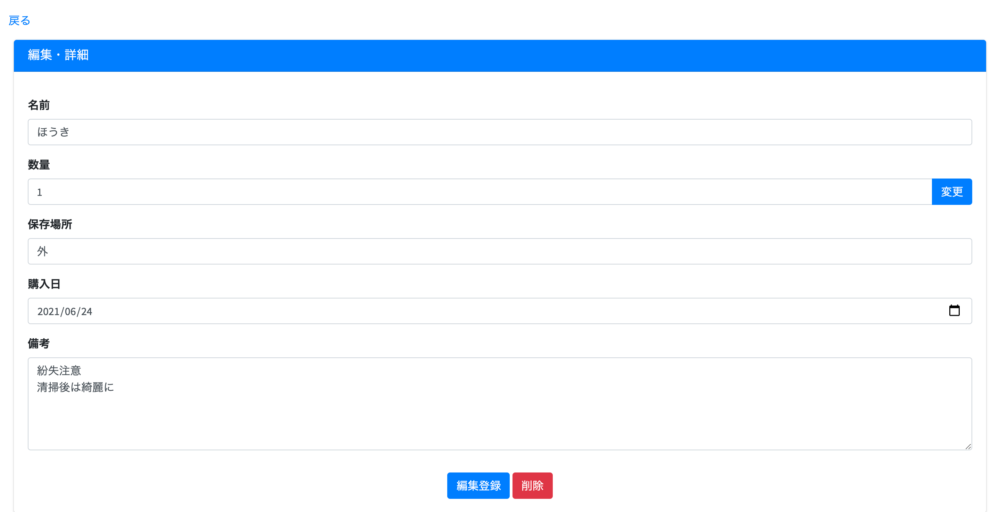
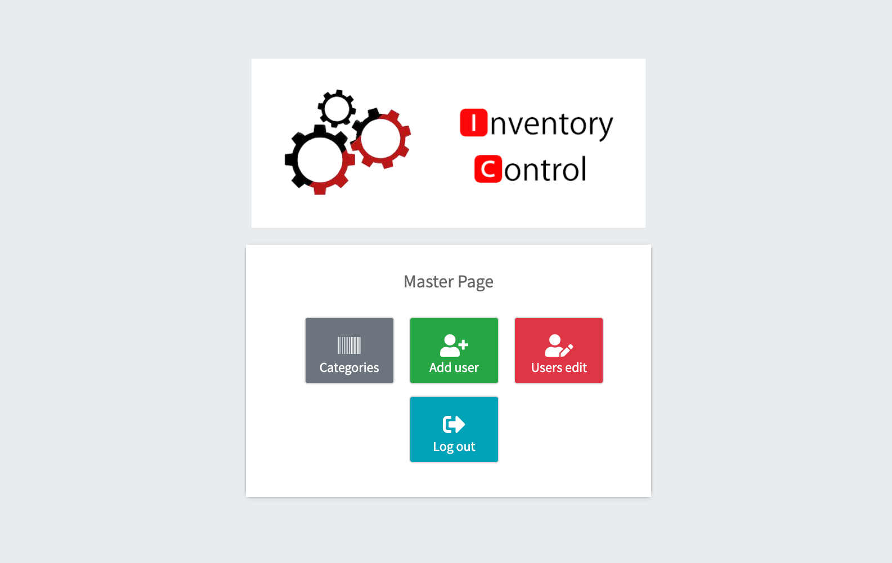
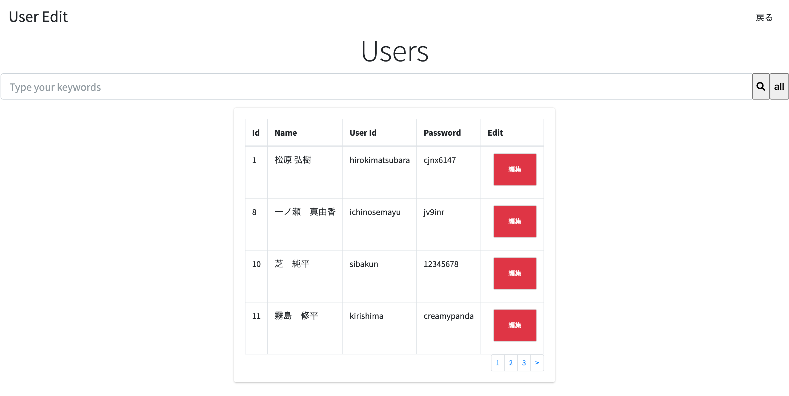
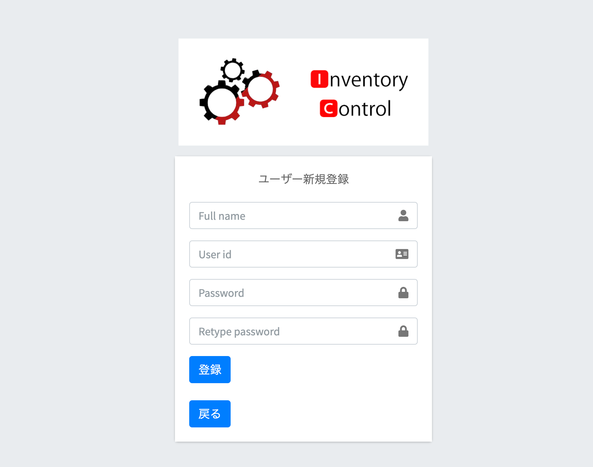

# Inventory Control

## 概要
外部案件を想定した在庫管理システムです。オフィスなどで発注した在庫の名前、数量、保管場所、日時、備考を管理する事ができます。
```
→CodeIgniterによるPHPのCRUD開発
→ログイン・会員登録機能
→在庫管理機能
→JavaScriptによる検索機能
→adminLTE使用
→Illustratorによるロゴ制作
```

<br>

## 環境構築
```
→ apache 
→ PHP 7.4.4
→ Mysql(MariaDB)
→ Codeigniter 3.2.0
```

<br>

## サイト画像
| ログイン画面 |
:--:|
|  |

| カテゴリ管理ページ |
:--:|
|  |

| 在庫管理ページ |
:--:|
|  |

| 編集ページ |
:--:|
|  |

| 管理者権限ページ |
:--:|
|  |

| ユーザー編集ページ |
:--:|
|  |

| 在庫管理者ページ |
:--:|
|  |


<br>

## 主な機能
```
<フロント>  
・ログインページ  
　　→ユーザーログインページ 
　　→管理者ログインページ  
　　→カテゴリー画面へ（管理者画面）  
　　→ユーザーの追加（管理者画面）  
　　→ユーザー情報の編集（管理者画面）  
　　→ログアウト  
・カテゴリーページ  
　　→カテゴリーの新規追加  
　　→カテゴリーの選択・削除  
　　→ログアウト  
・管理ページ  
　　→カテゴリーの変更  
　　→新規追加  
　　→編集・詳細・削除  
　　→ログアウト 
```

<br>

## 管理者・ユーザーの権限
管理者とユーザーの権限は以下とする  
|管理者|ユーザー|
| --- | --- |
|ログイン（id,password)・ログアウト|ログイン（id,password）・ログアウト 
ユーザーの新規登録（name,id,password）|投稿の閲覧・投稿・編集・削除
ユーザーの閲覧・編集・削除  
投稿の閲覧・投稿・編集・削除 

※管理者権限はusers table の　id=1　に該当するユーザーに設定

<br>

## 初期設定
データベースの設定
| パラメータ名 | <span style="font-size: 13px; ">指定値 | 例 |
----|----|----  
| Hostname | データベースサーバのホスト名 | localhostなど |
| Username | データベースに接続するために使用するユーザ名	 | rootなど |
| Password | データベースに接続するために使用するパスワード | ****** |
| Database | 接続したいデータベース名 | boardなど |
| Dbdriver | データベースの種類 | mysql postgres odbcなど※小文字で指定しなければならない |

<br>


## フォルダ構成
```
├─ html/ 各画面が置いてあるフォルダ
├─ src/ Codeigniter構造を置いているフォルダ
│    └─ application/管理画面
│         └─ config/ デフォルトコントローラーの設定やデータベースの設定ファイルが置いてあるフォルダ
│         └─ controler/ コントローラーのフォルダ
│         └─ model/ データベース周りの関数をまとめたクラスが置いてあるフォルダ
│         └─ views/ フロントエンドファイルをまとめたフォルダ
│    └─ img/ログインページアイコンを置いているフォルダ
├─ cms.sql/ mysql設定
```
