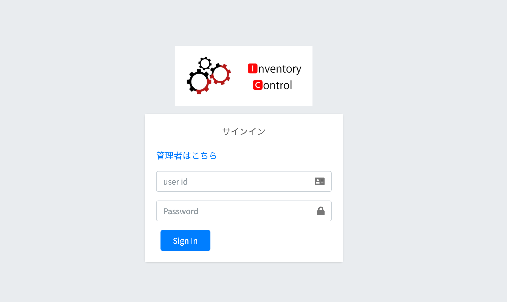

# Inventory Control

## 概要
外部案件を想定した在庫管理システムです。オフィスなどで発注した在庫の名前、数量、保管場所、日時、備考を管理する事ができます。
```
→CodeIgniterによるPHPのCRUD開発
→ログイン・会員登録機能
→在庫管理機能
→JavaScriptによる検索機能
→adminLTE使用
→Illustratorによるロゴ制作
```

<br>

## 環境構築
```
→ apache 
→ PHP 7.4.4
→ Mysql(MariaDB)
→ Codeigniter 3.2.0
```

<br>

## サイト画像
| ログイン画面 |
:--:|
|  |

| カテゴリ管理ページ |
:--:|
|  |

| 在庫管理ページ |
:--:|
|  |

| 編集ページ |
:--:|
|  |

| 管理者権限ページ |
:--:|
|  |

| ユーザー編集ページ |
:--:|
|  |

| 在庫管理者ページ |
:--:|
|  |


<br>

## 主な機能
```
<フロント>
→ ログインページ
→ 商品カテゴリー管理ページ
→ カテゴリ編集ページ
→ カテゴリ新規追加ページ
→ 発注品管理ページ
→ 発注品編集ページ
→ 発注品新規追加ページ
→ ログアウト機能

<管理者ページ>
→ ユーザー一覧ページ
→ 管理者編集ページ
→ 管理者登録ページ
→ ユーザー検索機能
```
